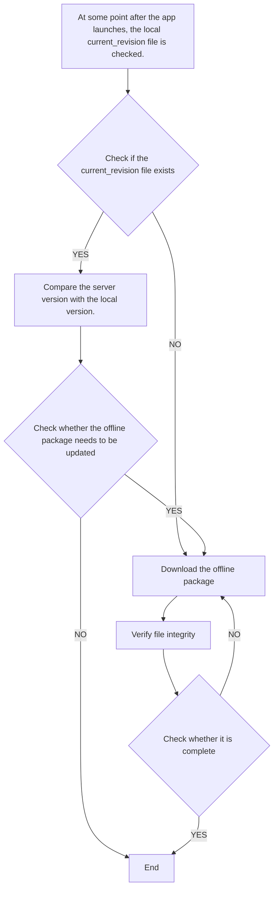

This article provides a simple analysis of several representative products under ByteDance through three approaches: [Reveal](https://revealapp.com/), [AppSight](https://www.appsight.io/), and IPA package inspection. The basic information is as follows:

| Product     | Version | Main Language | Third-party Libraries                                                     | Interface Builder         |
| -------- | ----- | ------------ | ------------------------------------------------------------ | ------------------------- |
| Toutiao | 7.1.7 | objc  | [AppSight](https://www.appsight.io/app/%E4%BB%8A%E6%97%A5%E5%A4%B4%E6%9D%A1) | Storyboard                |
| Pipixia   | 1.7.2 | objc  | [AppSight](https://www.appsight.io/app/%E7%9A%AE%E7%9A%AE%E8%99%BE-%E4%BB%8A%E6%97%A5%E5%A4%B4%E6%9D%A1%E5%AE%98%E6%96%B9%E7%88%86%E7%AC%91%E7%A4%BE%E5%8C%BA) | /                         |
| Douyin     | 5.8.0 | objc  | [AppSight](https://www.appsight.io/app/%E6%8A%96%E9%9F%B3%E7%9F%AD%E8%A7%86%E9%A2%91) | Storyboard(Launch Screen) |
| Lark     | 2.6.3 | Swift        | /                                                            | Storyboard(Launch Screen) |


### Toutiao

Partial page structure:

 * Home: UICollectionView + UITableView (unexpected, right?).
 * Article detail page: WKWebView (content) + Native (comments), wrapped inside a UIScrollView. For more details, refer to [iOS News App Content Page Technical Exploration](https://dequan1331.github.io/hybrid-page-kit.html).

From the perspective of third-party libraries, [GDataXML-HTML](https://github.com/graetzer/GDataXML-HTML), [libwebp](https://developers.google.com/speed/webp/), [YYKit](https://github.com/ibireme/YYKit), and [TTTAttributedLabel](https://github.com/TTTAttributedLabel/TTTAttributedLabel) can be considered standard libraries for news apps, as they also appear in [NetEase News](https://www.appsight.io/app/%E7%BD%91%E6%98%93%E6%96%B0%E9%97%BB). In terms of data transmission, Toutiao does not use traditional JSON format but instead adopts [protobuf](https://github.com/protocolbuffers/protobuf). GIF rendering is handled by the popular [FLAnimatedImage](https://github.com/Flipboard/FLAnimatedImage). Additionally, absolute layout is used in modules such as the "Home", "Xigua Video", "Short Video", and "Comment section", likely for performance considerations.

In addition, Toutiao has introduced [react-native](https://github.com/facebook/react-native) (0.55.4). When I was curious about where it was used, I found a directory `assets/react-native-feedcell/components/` in the IPA package, which contains two folders: `interest-tags` and `weather`. After inspecting the "My Channels" page on the homepage and the "Weather" page in search using Reveal, I initially thought these were not implemented with React Native. I assumed Toutiao had abandoned React Native like Airbnb but hadn’t removed it yet. However, this was eventually confirmed on the "Follow Interesting People" page (with deeply nested RCTView structures).


In the IPA package, I also found a `flutter_assets` directory and `Frameworks/Flutter.framework`, confirming that Toutiao is indeed using Flutter. The resources under `packages` suggest that Flutter is likely used for short video-related pages. Other notable findings include:

* WCDB.framework: https://github.com/Tencent/wcdb
* yw_1222.jpg (around 1KB): likely an Alibaba security-related image
* vconsole.js: https://github.com/WechatFE/vConsole
* pause_to_play_list: resource file from [lottie-ios](https://github.com/airbnb/lottie-ios). I also noticed the LOTAnimationView class, but it was not listed on AppSight
* `*_night` images in Assets.car: likely used for dark mode. Toutiao uses an inheritance-based approach for dark mode, with base classes such as `SSThemedView`, `SSThemedLabel`, and `SSThemedButton`. This raises the question: why doesn’t [DKNightVersion](https://github.com/draveness/DKNightVersion) meet their requirements?


### Pipixia

Compared to Toutiao, Pipixia, as a project from 2018, appears more conservative. Although Swift has been introduced, I did not find any evidence of its usage in UI so far. There is also no sign of cross-platform attempts. Of course, this is based only on the information I could access, and it’s possible that Pipixia inherits from the legacy Neihan Duanzi project.

From the perspective of third-party libraries, a notable one is [AsyncDisplayKit](https://github.com/facebookarchive/AsyncDisplayKit) ([Texture](https://github.com/TextureGroup/Texture)), but it only appears in the "Image" tab on the homepage. Additionally, there is a persistent MPVolumeView attached to the keyWindow, though its exact purpose is unclear.


### Douyin

Partial page structure:

- Home: UIPageViewController + UITableView
- Channel detail page: UIScrollView + UICollectionView. For implementation details, refer to another [blog](https://bawn.github.io/2019/02/NestedScrolling/)

From Reveal and IPA analysis alone, I didn’t find many interesting details about Douyin. However, it is strange that on AppSight, the last update time for the Chinese version is 2017.4.28, while the overseas version is slightly newer at 2017.12.11. My speculation is that a product at Douyin’s scale no longer relies on third-party libraries for rapid development. In other words, around April 2017, most features may have already been implemented without relying on third-party libraries.


### Lark(lark)

Lark is likely one of ByteDance’s newer products. The App Store shows version 1.9.1 released about eight months earlier. As a project from 2018, Lark not only adopts Swift as its primary language but also only supports iOS 10.0 and above.

First, looking at the **page structure**, Lark adopts the following architecture:

```
keywindow.rootViewController --> UINavigationController --> UITabBarController
```

The advantage of this approach is that all pages in the app share a single navigation stack, making management easier. Of course, this requires that the tab bar is not persistent.

Lark’s WebView optimization includes the following aspects:

#### webview pool

There are always two hidden WebViews attached to the keyWindow. When a WebView is needed, one is removed from the keyWindow and added to the target view controller, while a new WebView is initialized and added back to the keyWindow.


#### offline package

For an application like Lark that heavily relies on WebView, optimization is not just about improving startup speed. Through sandbox analysis, in the directory DocsSDK/ResourceService/docs_channel/eesz, I found several offline package files used for WebView optimization, including:


* 2b8654440ea92cd9ed66fb5211abd21c.md5: used to verify file integrity
* current_revision: version comparison file to determine whether updates are needed
* resource/bear: local JS and CSS files. The folder name reminds me of the note-taking app [bear](https://bear.app/)
* template/bear: HTML template files


The workflow for downloading offline packages is as follows:

<!--  -->



After that, HTML templates are loaded using the following approach. All related JS and CSS files are loaded locally instead of being fetched from the server, significantly improving page load speed.

```swift
let url = URL(fileURLWithPath: "")
let requset = URLRequest(url: url)
webView.load(requset)
```


#### request interception

However, further observation shows that the CSS and JS references in the HTML templates are not actually loaded locally:

```html
 <script src="//s3.pstatp.com/toutiao/monitor/sdk/slardar.js"></script>
    <script>window.Slardar && window.Slardar.install({ sampleRate: 1, bid: "docs_mobile", pid: "index", ignoreAjax: [/mcs\.snssdk\.com/], ignoreStatic: [] })</script>
    <script src="//s3.pstatp.com/eesz/resource/bear/js/vendors~mobile_app~mobile_update.8c813a80b906f70858fb.js"></script>
    <script src="//s3.pstatp.com/eesz/resource/bear/js/mobile_app~mobile_update.9c09912f9c786c0914b6.js"></script>
    <script src="//s3.pstatp.com/eesz/resource/bear/js/mobile_app.7fd12a95844c9b77cc0e.js"></script>
```

This is somewhat contradictory, as it makes the resources in the `resource/bear` folder seem redundant. After reviewing other materials, I speculate that Lark intercepts WebView requests. When JS, CSS, or even image resources are requested, it directly serves local cached files, namely those in the `resource/bear` directory.